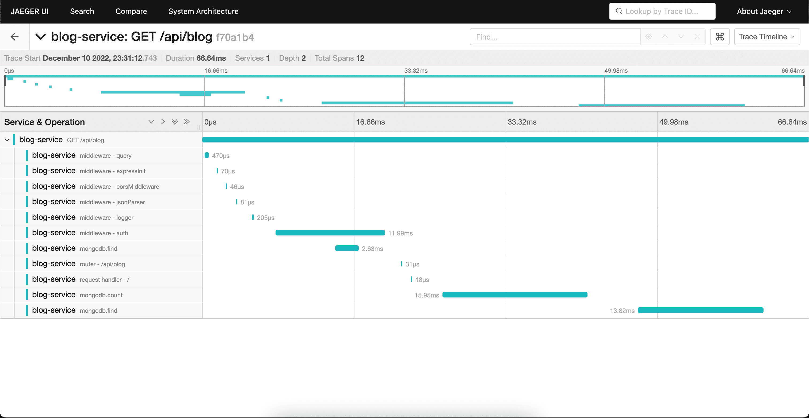
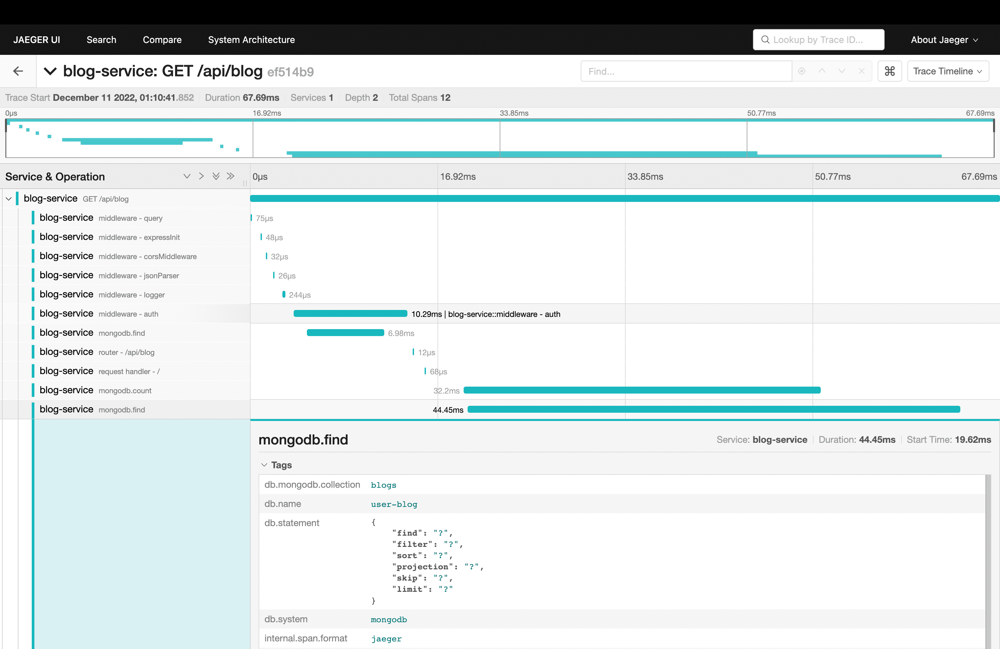

# Blog App

## Setup

1. Setup environment by copying `.env.sample` to `.env.development`
   - Add evnironment variables
2. Populate database with some fake data using `./scripts/dummyData.js`
3. Run `npm run dev` for starting development server

## Tracing

https://medium.com/jaegertracing/jaeger-tracing-a-friendly-guide-for-beginners-7b53a4a568ca  
https://www.aspecto.io/blog/getting-started-with-opentelemetry-node/  
https://www.aspecto.io/opentelemetry-bootcamp/  
https://www.jaegertracing.io/docs/1.30/sampling/

